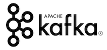
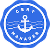

# Devops

Our stack is comprised the following:

Services |  | Note
:---: | :---: | ---
 | [Docs](https://doc.akka.io/docs/akka-management/current/discovery/kubernetes.html) | Akka management queries Kubernetes to discover other nodes in the network when [bootstrapping the cluster](https://doc.akka.io/docs/akka-management/current/bootstrap/index.html)
 | [CQL](https://cassandra.apache.org/doc/latest/cql/) [Academy](https://academy.datastax.com/) | Cassandra is NoSQL database with a SQL-like query language called "CQL". Data replicated and distributed to ring of Cassandra nodes which gives usfault tolerance and horizontal scalability
 | [Docs](https://kafka.apache.org/documentation/) [Quickstart](https://kafka.apache.org/quickstart) | Kafka is our inter-service messaging system. Messages are partitioned into multiple channels which means async throughput will be distributed over multiple broker nodes
 | [Github](https://github.com/jetstack/cert-manager) | Cert Manager is a tool that automatically provisions and renews our Let's Encrypt certificates. These certificates are pulled into our Google [HTTPS load balancer](https://cloud.google.com/kubernetes-engine/docs/concepts/ingress#setting_up_https_tls_between_client_and_load_balancer) via [Google's Ingress Controller](https://cloud.google.com/kubernetes-engine/docs/concepts/ingress#setting_up_https_tls_between_client_and_load_balancer)
 | [Github](https://github.com/hyperledger/iroha) [Docs](https://iroha.readthedocs.io/en/latest/) | Iroha is our immutable ledger backing our wallet assets. The ledger runs over multiple instances using a crash fault-tolerant consensus mechanism

## Kubernetes

- [Kubernetes best practices: Resource requests and limits](https://cloud.google.com/blog/products/gcp/kubernetes-best-practices-resource-requests-and-limits)

